# RRT学习

[参考资料一：基于采样的运动规划算法-RRT(Rapidly-exploring Random Trees)](https://zhuanlan.zhihu.com/p/133224593)

[参考资料二：移动机器人运动规划](https://www.shenlanxueyuan.com/course/633?source=1)

[参考资料三：运动规划RRT*算法图解](https://blog.csdn.net/weixin_43795921/article/details/88557317)

[参考资料四：PathPlanning](https://github.com/zhm-real/PathPlanning/tree/master)

[参考资料五：路径规划——改进RRT算法](https://zhuanlan.zhihu.com/p/51087819)

## 简单介绍

### 快速搜索随机树算法（Rapidly-exploring Random Tree，RRT）

- 快速搜索随机树算法由Lavalle提出，是一种增量方式增长的随机采样算法，用于解决具有代数约束和微分约束的高维空间问题。该算法的优势在于无需对系统建模，也无需对搜索区域进行几何划分，因此具有高覆盖率、广泛搜索的特点。然而，其计算代价较高，因此研究者们提出了多种改进形式。


- 许多传统的路径规划算法，如栅格法、可视图法、A*、D*等，虽然各有其优点，但是它们难以考虑到移动机器人的非完整约束限制。非完整约束是指移动机器人在运动过程中可能受到的非典型约束，例如，车辆可能无法做到瞬间停止或改变方向，机器人可能受到动力学约束的限制等。这些约束在传统的规划算法中难以被充分考虑，因此导致了在实际应用中可能出现的路径不可行或效率低下的问题。

- 而快速随机搜索树算法（Rapidly-exploring Random Tree，RRT）则能够有效地考虑到移动机器人的非完整约束限制，并且能够有效地搜索整个解空间。RRT算法以增量方式逐步生成树形结构，利用随机采样和扩展策略来探索状态空间，从而快速地生成可行路径。由于其随机性和增量性质，RRT算法能够很好地适应非完整约束，并且能够在搜索过程中避免对移动机器人的具体动力学模型进行建模。因此，RRT算法能够在考虑到非完整约束的情况下，快速地搜索到移动机器人的可行路径，从而实现高效的路径规划。
  
### 为什么RRT能考虑到非完整约束？
RRT（快速随机搜索树算法）能够考虑到非完整约束的原因在于其设计和工作原理的特点：

1. **增量式扩展：** RRT算法以增量方式逐步生成树形结构，通过不断扩展树来探索状态空间。这种增量式的方法使得算法能够灵活地适应不同类型的约束，包括非完整约束。

2. **随机采样：** RRT算法通过随机采样的方式来探索状态空间，而不是事先对空间进行离散化或划分。这种随机性使得算法能够在搜索过程中充分地覆盖整个解空间，包括可能受到非完整约束影响的区域。

3. **无需模型：** RRT算法不需要对移动机器人的具体动力学模型进行建模。相反，它只需要知道机器人的当前状态和可行动作，然后根据这些信息进行树的扩展。这使得算法能够更加灵活地适应各种类型的约束，包括非完整约束。

4. **局部搜索：** RRT算法在树的生长过程中，会根据当前的状态和目标状态进行局部搜索，以找到距离当前状态较近且可行的扩展方向。这种局部搜索的方式使得算法能够更加高效地探索状态空间，并考虑到可能存在的非完整约束。

RRT算法通过增量式扩展、随机采样、无需模型和局部搜索等特点，使得其能够有效地考虑到移动机器人的非完整约束，从而在路径规划中发挥作用。

### RRT的改进算法

1. **Goal-bias RRT算法**：
   - 将目标节点作为采样点出现，并可以控制目标点出现的概率。

2. **Extend RRT算法**：
   - 引入路径点集合，加快收敛速度，提高路径稳定性。

3. **Bi-RRT算法和RRT-Connect算法**：
   - 从初始点和目标点生成两棵树，直到两棵树连在一起，提高了算法的效率。

4. **Local-tree-RRT算法**：
   - 针对难以迅速通过的狭窄通道问题，提出了局部树方法。

5. **Dynamic-RRT算法**：
   - 引入修剪和合并操作，去除无效节点后再继续搜索。

### RRT的优化算法

由于RRT算法采样的随机性，生成的路径往往只是可行路径而不是最优路径，因此有些改进算法可以对生成的路径进行优化，如：

- **RRT*算法**：
  - 与基本RRT算法的主要区别在于引入了对新生成节点相邻节点的搜索，选择低代价的父节点，并进行重新布线，是解决高维最优路径规划问题的突破性方法。RRT*算法是渐进最优的，若给定足够的运行时间，总是收敛到最优解。

以上是RRT算法及其改进的概述，以及针对其生成的路径进行优化的一些方法。
## 基础RRT
RRT（快速探索随机树）算法是一种用于路径规划的算法，其基本流程如下：
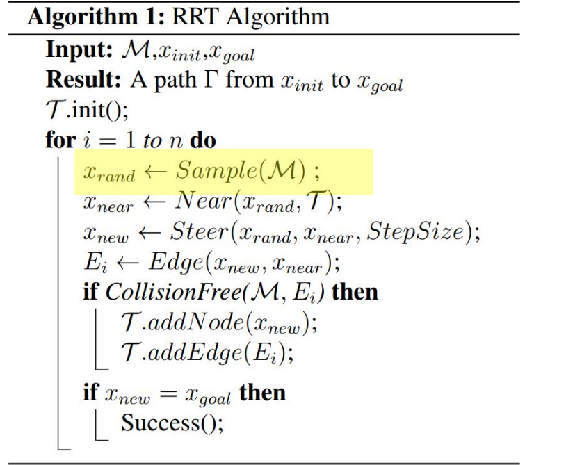
在这段代码中，M是地图的数据结构，x_init是起始点，x_goal是目标点。随机在地图中的可行区域生成随机节点x_rand；然后查找最近点x_near，即在当前的地图中与x_rand距离最近的点；然后沿着x_rand和x_near之间的stepsize方向尝试延伸新的节点x_new；CollisionFree(M, E)是检查新生成的边(x_new, x_near)是否与地图中的障碍物没有冲突，如果没有冲突，则将x_new加入到地图中成为一个新的节点并连接E。重复上述过程，直至找到从起点到终点的路径。
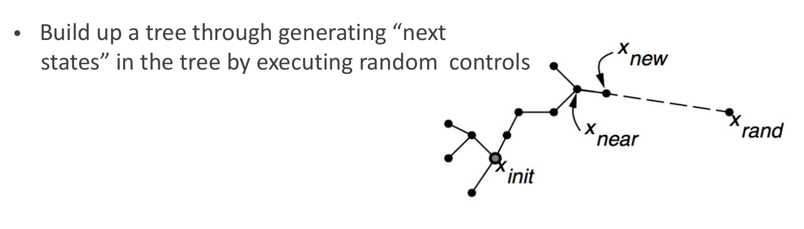
1. **初始化**：
   - 确定搜索空间（通常是一个包含机器人或车辆可行动区域的区域）。
   - 指定起始点 `x_init` 和目标点 `x_goal`。
   - 创建一棵树 `T`，并将起始点作为树的根节点。

2. **迭代**：
   - 从搜索空间中随机采样一个点 `x_rand`。
   - 在树 `T` 中找到离 `x_rand` 最近的节点 `x_near`。
   - 从节点 `x_near` 沿着一定步长（StepSize）朝向 `x_rand` 移动，生成一个新的节点 `x_new`。
   - 如果从 `x_near` 到 `x_new` 的路径上没有碰撞（即路径是自由的），则将 `x_new` 加入树 `T`，并以 `x_near` 到 `x_new` 的边作为树的新分支。
   - 重复以上步骤直到达到终止条件：
     - 当找到一个新的节点 `x_new` 和目标点 `x_goal` 的距离小于某个阈值时，或者树 `T` 中节点的数量达到一定的限制。
     - 或者可以通过其他条件判断搜索是否结束。
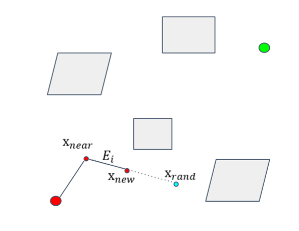
3. **连接到目标**：
   - 如果最后生成的节点 `x_new` 足够接近目标点 `x_goal`，则连接 `x_new` 到 `x_goal`，完成路径。

4. **路径提取**：
   - 从树 `T` 中回溯从起始点到目标点的路径。这可以通过从目标节点开始回溯，沿着树的边找到父节点，直到回到起始点为止。

5. **路径优化**（可选）：
   - 对提取的路径进行优化，以满足特定的约束条件或者最小化某种指标（例如路径长度、平滑度等）。

通过这样的流程，RRT算法能够在高维、复杂的空间中快速生成可行的路径。
### C++代码简单实现
```cpp
#include <iostream>
#include <vector>
#include <cmath>
#include <cstdlib>
#include <ctime>

using namespace std;

// 定义二维点的结构体
struct Point {
    double x;
    double y;
};

// 计算两个点之间的欧几里得距离
double distance(const Point& a, const Point& b) {
    return sqrt(pow(a.x - b.x, 2) + pow(a.y - b.y, 2));
}

// 生成随机点
Point generateRandomPoint(double maxX, double maxY) {
    Point randomPoint;
    randomPoint.x = (double)rand() / RAND_MAX * maxX;
    randomPoint.y = (double)rand() / RAND_MAX * maxY;
    return randomPoint;
}

// RRT算法函数
vector<Point> rrt(Point start, Point goal, double maxX, double maxY, int maxIter) {
    vector<Point> tree;
    tree.push_back(start);

    for (int i = 0; i < maxIter; ++i) {
        Point randomPoint = generateRandomPoint(maxX, maxY);

        // 找到树中最近的点
        int nearestIndex = 0;
        double minDist = distance(tree[0], randomPoint);
        for (int j = 1; j < tree.size(); ++j) {
            double dist = distance(tree[j], randomPoint);
            if (dist < minDist) {
                minDist = dist;
                nearestIndex = j;
            }
        }
        Point nearestPoint = tree[nearestIndex];

        // 将最近的点朝着随机点移动一步
        // 实际中可能需要更复杂的运动模型来实现此步骤
        Point newPoint;
        newPoint.x = nearestPoint.x + ((randomPoint.x - nearestPoint.x) / minDist) * 0.1;
        newPoint.y = nearestPoint.y + ((randomPoint.y - nearestPoint.y) / minDist) * 0.1;

        tree.push_back(newPoint);

        // 如果新点接近目标点，结束搜索
        if (distance(newPoint, goal) < 0.1) {
            tree.push_back(goal);
            break;
        }
    }

    return tree;
}

int main() {
    srand(time(0));

    Point start = {1.0, 1.0};
    Point goal = {9.0, 9.0};
    double maxX = 10.0;
    double maxY = 10.0;
    int maxIter = 1000;

    vector<Point> path = rrt(start, goal, maxX, maxY, maxIter);

    cout << "Generated path:" << endl;
    for (const Point& point : path) {
        cout << "(" << point.x << ", " << point.y << ")" << endl;
    }

    return 0;
}
```
## 效率优化 RRT
### KD-tree 运用在RRT中

KD树（k维树）是一种在多维空间中组织点的数据结构，用于支持快速检索操作。在RRT（Rapidly-exploring Random Tree，快速随机树）算法中，KD树可以有效地用于找到最近邻点，即在树中找到离新采样点最近的点（`x_near`）。

在RRT算法中，每次迭代都需要找到距离新随机采样点（`x_rand`）最近的树节点（`x_near`），以便从该节点向采样点方向扩展新的分支。在高维空间中，如果使用简单的线性搜索，这个过程可能非常耗时，因为需要计算新采样点与树中每一个点的距离。这是KD树发挥作用的地方。

在RRT中使用KD树的基本步骤如下：

1. **初始化**：在算法开始时，初始化一个KD树，包含起始点`x_init`。

2. **添加节点**：当算法向RRT添加新节点`x_new`时，同时将这个新节点添加到KD树中。

3. **查找最近邻**：每次需要找到新的随机采样点`x_rand`的最近邻时，使用KD树来快速检索。

4. **优化**：由于KD树的结构，查找最近邻的时间复杂度通常比线性搜索要低，特别是在点的数量较多时。

5. **更新**：每次树T添加新的节点后，KD树也需要更新，以包含新的点。

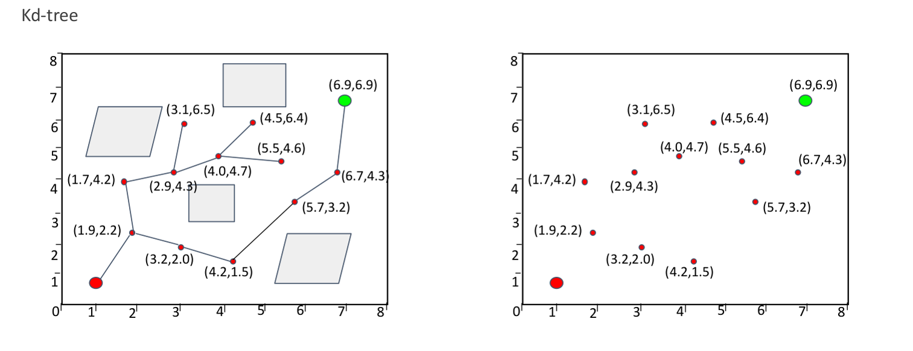
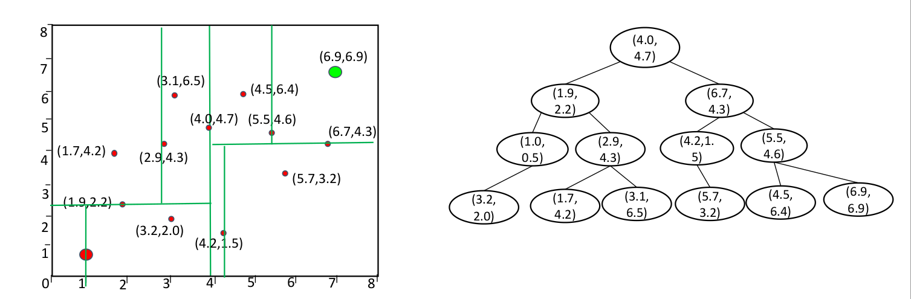
KD树优化了查找最近邻的过程，允许RRT算法在较高维度的空间中更有效地运行。尽管如此，KD树本身在每次插入新节点时也需要维护，特别是在动态环境中，这可能会带来额外的计算负担。此外，KD树的效率可能会随着维度的增加而降低，这是所谓的“维度的诅咒”。尽管存在这些潜在的问题，KD树通常仍然是提高RRT性能的有效方法。
### Bidirectional RRT / RRT Connect
RRT Connect算法从初始状态点和目标状态点同时扩展随机树从而实现对状态空间的快速搜索。

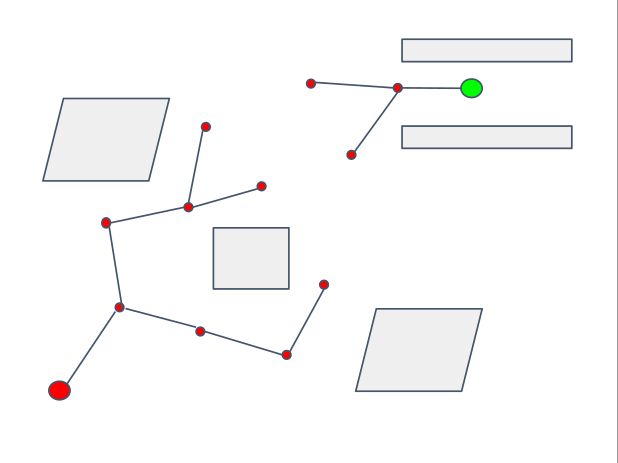
RRT-Connect算法是RRT（Rapidly-exploring Random Tree）算法的一个变体，它以更高的效率寻找从起始状态到目标状态的路径。RRT-Connect从起始点和目标点同时构建两棵树（称为`Ta`和`Tb`），一棵从起始点开始生长，另一棵从目标点开始生长，并尝试连接两棵树。当两棵树相遇时，路径就被找到了。

RRT-Connect算法的关键实现步骤是：

1. **双树搜索**：同时从起始点和目标点构建两棵树。
2. **连接尝试**：每次迭代中，尝试将一棵树扩展到另一棵树中的点。
3. **交替扩展**：交替地扩展两棵树，这有助于平衡搜索过程并避免一棵树过于集中在状态空间的一个区域。
4. **路径平滑**：一旦两棵树连接，可以通过移除多余的节点和平滑操作来优化路径。

下面是RRT-Connect算法的伪代码

```cpp
算法：RRT-Connect
输入：x_init（初始点）, x_goal（目标点）
输出：从x_init到x_goal的路径

过程 RRT-Connect(x_init, x_goal)
  Ta.init(x_init)  // 初始化树Ta，根为初始点
  Tb.init(x_goal)  // 初始化树Tb，根为目标点
  while true do
    x_rand ← Sample()  // 随机采样一个点x_rand
    if Extend(Ta, x_rand) ≠ Trapped then  // 尝试向x_rand扩展树Ta
      if Extend(Tb, Ta.newest) = Reached then  // 如果树Ta可以扩展到树Tb的最新点，则路径找到
        return Path(Ta, Tb)  // 返回从Ta到Tb的路径
    Swap(Ta, Tb)  // 交换Ta和Tb，下一次迭代将尝试扩展Tb
  end while
End 过程

函数 Extend(T, x)
  x_near ← NearestNeighbor(T, x)  // 在树T中找到最接近x的点x_near
  x_new ← Steer(x_near, x)  // 从x_near朝x方向生成一个新点x_new
  if CollisionFree(x_near, x_new) then  // 检查x_near到x_new的路径是否无碰撞
    T.add(x_new)  // 如果无碰撞，将x_new添加到树T
    if x_new = x then
      return Reached  // 如果x_new等于x，则表示达到了x
    else
      return Advanced  // 否则，表示树向x方向前进了一步
  end if
  return Trapped  // 如果从x_near到x_new有碰撞，表示这个方向走不通
End 函数
```
在这个伪代码中：

- `Sample()`随机在状态空间中选取一个点。
- `Extend()`函数尝试将树向`x_rand`扩展，如果新点`x_new`可以无障碍地连接到`x_near`，则将它添加到树中。
  - 如果`x_new`与`x_rand`一样，我们认为已经达到了目标。
  - 如果我们能够向`x_rand`方向前进，即使没有到达，也表示有进展。
  - 如果不能前进，表示陷入了障碍物或者走不动了。
- `NearestNeighbor()`函数在树`T`中找到最接近`x`的点。
- `Steer()`函数从`x_near`朝向`x`方向生成新点`x_new`。
- `CollisionFree()`函数检查从`x_near`到`x_new`的路径是否没有与障碍物碰撞。
- `Swap()`函数交换两棵树，以便交替扩展。

RRT-Connect的效率较高，因为它减少了搜索空间，同时扩展两棵树加速了搜索过程，通常比单树RRT更快找到路径。
### C++代码简单实现
```cpp
#include <iostream>
#include <vector>
#include <cmath>
#include <limits>
#include <random>

// 定义状态点
struct Point {
    double x, y;

    Point(double x, double y) : x(x), y(y) {}

    // 计算两点间距离
    double distanceTo(const Point& other) const {
        return std::hypot(x - other.x, y - other.y);
    }
};

// 定义树节点
struct Node {
    Point point;
    Node* parent;

    Node(Point point) : point(point), parent(nullptr) {}
};

class Environment {
public:
    // 假设我们有一个函数来判断一个点是否在障碍物内部
    bool isInsideObstacle(const Point& p) {
        // 这里需要实现障碍物的碰撞检测逻辑
        // 例如，对于简单的矩形障碍物，你需要判断点是否在矩形内部
        return false;
    }

    // 检查路径段是否与任何障碍物相交
    bool isCollisionFree(const Point& from, const Point& to) {
        // 这里需要实现路径段的碰撞检测逻辑
        // 你可以通过插值方式在两点间取若干点，然后用isInsideObstacle检查这些点
        return true;
    }
};

std::vector<Point> smoothPath(const std::vector<Point>& path, Environment& env) {
    std::vector<Point> smoothedPath;
    // 添加起始点
    smoothedPath.push_back(path.front());

    // 实现路径平滑逻辑
    // 例如，尝试连接路径上相隔较远的点，如果它们之间的连接是自由的，则跳过中间的点
    for (size_t i = 0; i < path.size(); ++i) {
        for (size_t j = path.size() - 1; j > i; --j) {
            if (env.isCollisionFree(path[i], path[j])) {
                // 如果路径是自由的，添加到平滑路径并跳过中间的点
                smoothedPath.push_back(path[j]);
                i = j; // 跳到这个点，继续平滑剩余的路径
                break;
            }
        }
    }

    // 添加终点
    smoothedPath.push_back(path.back());
    return smoothedPath;
}

// RRT树定义
class RRTree {
public:
    std::vector<Node*> nodes;

    ~RRTree() {
        for (auto* node : nodes) {
            delete node;
        }
    }

    void addNode(Node* node) {
        nodes.push_back(node);
    }

    Node* nearestNeighbor(const Point& point) {
        Node* nearest = nullptr;
        double minDistance = std::numeric_limits<double>::max();

        for (auto* node : nodes) {
            double distance = node->point.distanceTo(point);
            if (distance < minDistance) {
                minDistance = distance;
                nearest = node;
            }
        }

        return nearest;
    }
};

// 随机数生成
std::random_device rd;
std::mt19937 gen(rd());
std::uniform_real_distribution<> dis(0.0, 1.0);

// 随机采样函数
Point sample(double minX, double maxX, double minY, double maxY) {
    return Point(dis(gen) * (maxX - minX) + minX, dis(gen) * (maxY - minY) + minY);
}

// 主算法实现
bool connect(RRTree& tree, const Point& point, double stepSize, Environment& env) {
    Node* nearest = tree.nearestNeighbor(point);
    Point direction(point.x - nearest->point.x, point.y - nearest->point.y);
    double length = std::sqrt(direction.x * direction.x + direction.y * direction.y);
    
    // 检查新点是否在障碍物内部或者新点与最近点之间的路径是否有碰撞
    Point stepPoint(nearest->point.x + stepSize * direction.x / length,
                    nearest->point.y + stepSize * direction.y / length);
    if (!env.isInsideObstacle(stepPoint) && env.isCollisionFree(nearest->point, stepPoint)) {
        Node* newNode = new Node(stepPoint);
        newNode->parent = nearest;
        tree.addNode(newNode);
        return true;
    }
    return false;
}

// RRT-Connect算法主函数
void rrtConnect(const Point& start, const Point& goal, double stepSize, double minX, double maxX, double minY, double maxY, Environment& env) {
    RRTree Ta, Tb;
    Ta.addNode(new Node(start));
    Tb.addNode(new Node(goal));

    while (true) {
        // 从Ta向随机点扩展
        Point randPoint = sample(minX, maxX, minY, maxY);
        if (connect(Ta, randPoint, stepSize, env)) {
            // 如果Ta能连接到Tb
            if (connect(Tb, Ta.nodes.back()->point, stepSize, env)) {
                std::cout << "Path found!" << std::endl;
                return;
            }
        }
        // 交换Ta和Tb
        std::swap(Ta, Tb);
    }
}

int main() {
    Point start(0, 0);
    Point goal(10, 10);
    double stepSize = 0.5;
    double minX = 0;
    double maxX = 10;
    double minY = 0;
    double maxY = 10;
    Environment env;
    rrtConnect(start, goal, stepSize, minX, maxX, minY, maxY, env);

    return 0;
}
```

## Rapidly-exploring Random Tree*
Rapidly-exploring Random Tree*（RRT*）是一种经典的路径规划算法，用于在给定环境中找到从起点到目标点的最优路径。它是基于Rapidly-exploring Random Tree（RRT）算法的改进版本，通过不断扩展树结构来搜索最优路径。RRT* 通过引入目标偏向技术（goal biasing）和重新连接策略（rewiring）来优化树的生长过程，从而在搜索空间中更有效地发现最优路径。

RRT* 的基本思想是在状态空间中随机生成节点，并将这些节点逐步连接起来，形成一棵树。在每次迭代中，算法会选择最近的树节点，并试图将新生成的节点连接到这些节点上。然后，根据一定的准则，算法会重新连接一些节点，以改善路径的质量。这个过程会持续进行，直到达到预先设定的停止条件，比如找到了足够优质的路径或者达到了最大迭代次数。
以下是RRT* 算法的基本步骤：

1. **初始化**：设定起点和目标点，创建一棵只包含起点的树T。

2. **迭代**：重复以下步骤直到满足停止条件：
   - **随机采样**：在状态空间中随机生成一个节点。
   - **最近邻节点**：从树T中找到距离新节点最近的节点。
   - **扩展**：从最近邻节点沿着一定步长向新节点方向扩展，并生成一条路径段。
   - **连接**：将新节点连接到树T上，形成一条新的路径。
   - **重新连接**：对于树T中距离新节点更近且到达新节点的路径成本更低的节点，检查是否通过连接新节点可以获得更优路径。如果是，则重新连接这些节点。

3. **停止条件**：达到最大迭代次数或者找到了满足要求的路径。

4. **路径提取**：从起点开始，沿着树T中连接的节点构成的路径，找到从起点到目标点的最优路径。

RRT*算法通过在每次迭代中根据启发式信息重新连接树节点，逐步优化树的结构，从而最终找到最优路径。


### 以下图像展示工作原理和算法伪代码。
#### 伪代码一
```cpp
Algorithm 2: RRT Algorithm
Input: M, x_init, x_goal
Result: A path Γ from x_init to x_goal

T.init();
for i = 1 to n do
    x_rand ← Sample(M);
    x_near ← Near(x_rand, T);
    x_new ← Steer(x_rand, x_near, StepSize);
    if CollisionFree(x_new) then
        X_near ← Near(Γ, x_new);
        x_min ← ChooseParent(X_near, x_near, x_new);
        T.addNodeEdge(x_min, x_new);
        T.rewire();
end for
```
#### 伪代码二
```cpp
算法：RRT
输入：搜索空间 M，初始节点 x_init，目标节点 x_goal，步长 Δ，最大节点数 N
输出：包含从 x_init 到 x_goal 路径的 RRT 树 T（如果存在的话）
函数 RRT(M, x_init, x_goal, Δ, N)
    创建一个新的树 T 并用 x_init 初始化
    for i = 1 to N do
        x_rand ← SampleRandomPoint(M)
        x_nearest ← FindNearestNode(T, x_rand)
        x_new ← SteerTowards(x_nearest, x_rand, Δ)
        if IsCollisionFree(x_nearest, x_new, M) then
            x_min ← x_nearest  // 将最近距离节点初始化为最近的节点
            X_near ← FindNearNodes(T, x_new, Δ)
            for each x_near in X_near do
                if IsCollisionFree(x_near, x_new, M) and Cost(x_near) + Distance(x_near, x_new) < Cost(x_min) then
                    x_min ← x_near
            T.AddNode(x_new)
            T.AddEdge(x_min, x_new)
            for each x_near in X_near do
                if IsCollisionFree(x_new, x_near, M) and Cost(x_new) + Distance(x_new, x_near) < Cost(x_near) then
                    T.RemoveEdge(Parent(x_near), x_near)
                    T.AddEdge(x_new, x_near)
            if ReachedGoalRegion(x_new, x_goal) then
                return T  // 路径找到
    return T  // 路径未找到；返回树 T

// 支持函数：

函数 SampleRandomPoint(M)
    // 该函数应从搜索空间 M 中随机抽取一个点。

函数 FindNearestNode(T, x_rand)
    // 该函数应在树 T 中找到离点 x_rand 最近的节点。

函数 SteerTowards(x_nearest, x_rand, Δ)
    // 该函数应从 x_nearest 朝向 x_rand 方向控制，但只能控制到距离 Δ。

函数 IsCollisionFree(x1, x2, M)
    // 该函数应检查从 x1 到 x2 的路径在搜索空间 M 中是否没有碰撞。

函数 FindNearNodes(T, x_new, Δ)
    // 该函数应找到树 T 中所有在 x_new 周围 Δ 半径内的节点。

函数 Cost(x)
    // 该函数应计算从树 T 的根到达节点 x 的成本。

函数 Distance(x1, x2)
    // 该函数应计算两点 x1 和 x2 之间的距离。

函数 ReachedGoalRegion(x, x_goal)
    // 该函数应检查 x 是否在 x_goal 周围的目标区域内。

函数 Parent(x)
    // 该函数应返回树 T 中 x 的父节点。
```
这个伪代码提供了RRT算法的一个概要，用于生成从初始位置 `x_init` 到目标位置 `x_goal` 的路径。在每次迭代中，算法随机采样新的点 `x_rand`，然后在树 `T` 中寻找最近的点 `x_near`，并试图在 `x_near` 的方向上以固定的 `StepSize` 生成新的点 `x_new`。如果新点 `x_new` 到 `x_near` 的路径不与任何障碍物碰撞，它会被添加到树中，并且会尝试对树进行重连（rewiring）以改进路径。
- 红色点：表示已经生成的节点，它们一起构成了探索空间的树。
- 绿色点：表示目标位置，算法的目的是找到一条从起始点到达这个目标位置的路径。
- 蓝色圆圈：表示搜索的一个局部范围，用于找到距离随机采样点 $( x_{rand} )$ 最近的点 $( x_{near} )$。
- 黑色线：表示树的枝干，连接节点的路径。
- $( x_{rand} )$：随机采样点，算法在整个空间随机选择一个点。
- $( x_{near} )$：树中距离 $( x_{rand} )$ 最近的点。
- $( x_{new} )$：沿着 $( x_{near} )$ 到 $( x_{rand} )$ 方向上的一个新点，该点通过一个预定的步长（StepSize）生成。
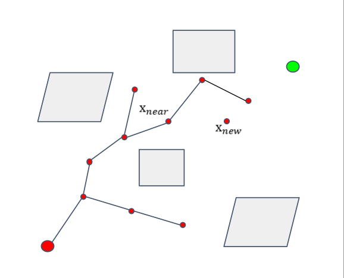

灰色的矩形表示障碍物，算法在生成新的节点时需要避开这些障碍物。

图像右边部分显示了RRT算法的伪代码，描述了算法的基本步骤：
1. 初始化树（T.init()）。
2. 进行n次迭代，在每次迭代中：
   - 在空间中随机采样一个点 $( x_{rand} )$。
   - 找到树中离 $( x_{rand} )$ 最近的点 $( x_{near} )$。
   - 沿着 $( x_{near} )$ 到 $( x_{rand} )$ 的方向，生成一个新的点 $( x_{new} )$，并检查从 $( x_{near} )$ 到 $( x_{new} )$ 的路径是否无碰撞。
   - 如果无碰撞，找到最佳的父节点 $( x_{min} )$，并将 $( x_{new} )$ 添加到树中。
   - 重新连接树，以找到更短的路径。
### 步骤体现
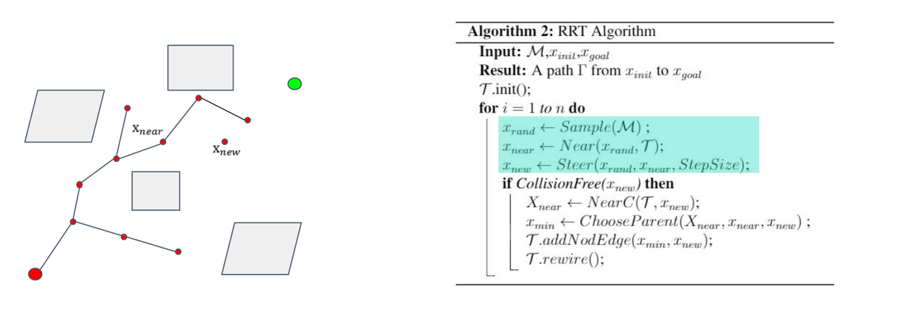
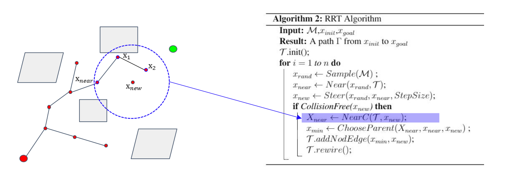
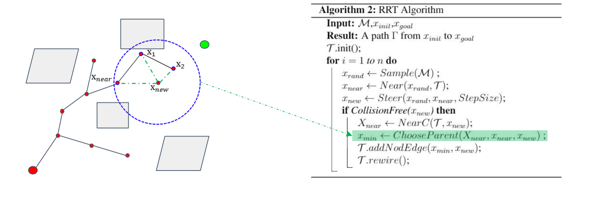
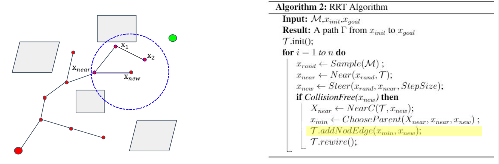


**RRT*算法与RRT算法的区别主要在于两点：**

- rewire的过程。即为$( x_{new} )$ 重新选择父节点的过程；


- 随机树重布线的过程；
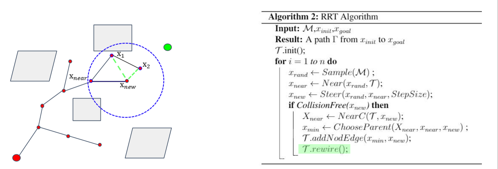
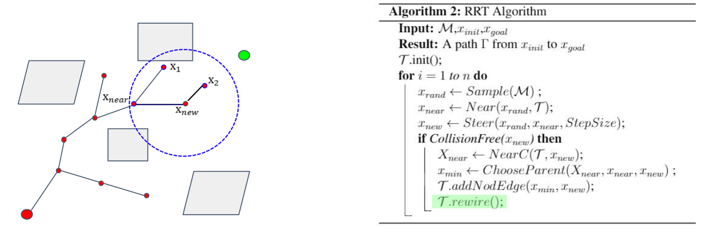
## Informed RRT*

